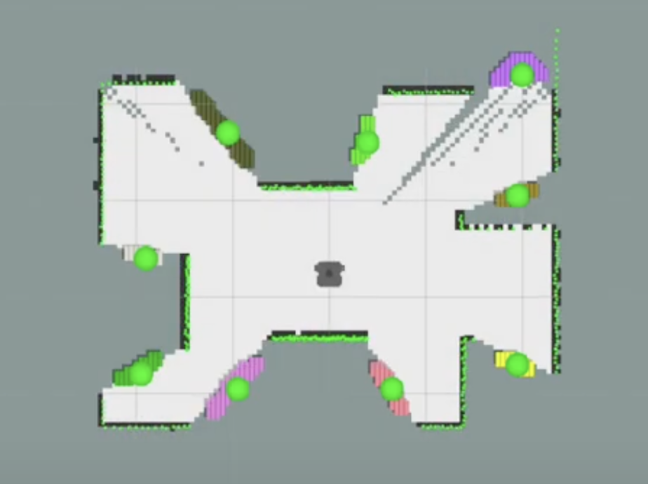
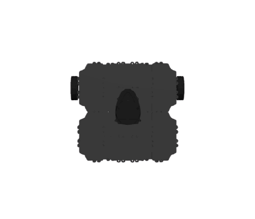
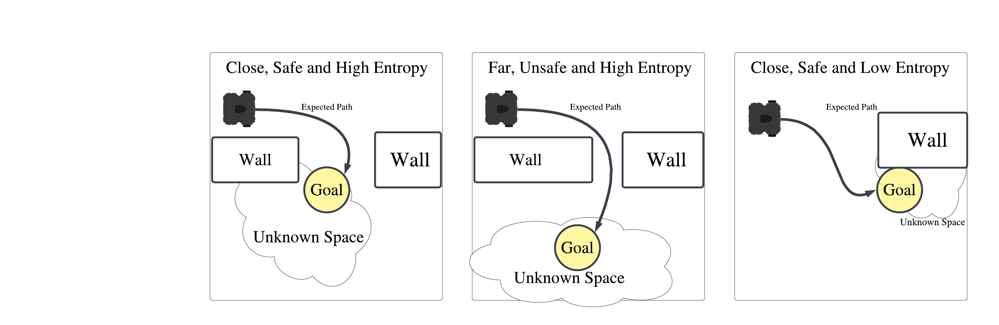
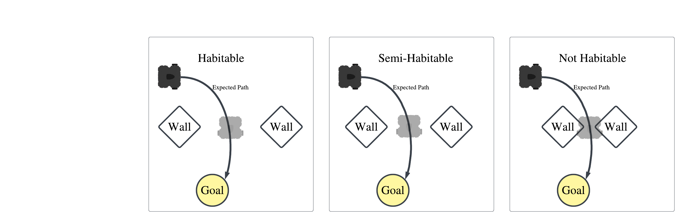

# Intelligent Frontier Exploration

## Summary  

The project focuses on implementing an autonomous navigation system capable of detecting and exploring frontiers efficiently in unknown environments. A frontier is defined as the boundary where known unoccupied space meets unknown space. The goal is to segment these frontiers into distinct regions and navigate through them systematically to explore the entire map in the least amount of time.

<div style="text-align:center;">
  
  
</div>

Frontier exploration involves several key steps:

1. **Frontier Detection:**
   - Utilize edge detection techniques to identify frontier regions where known unoccupied space meets unknown space.
   - Refine detected frontiers to remove false regions and simplify their topology.

2. **Frontier Segmentation:**
   - Segment candidate frontier points into distinct clusters using connected component analysis algorithms.
   - Aim for semi-continuous regions that are reachable by the robot.

3. **Centroid Ranking:**
   - Rank centroids of frontier segments based on expected utility calculations, considering both map entropy and distance from the robot.
   - Encourage exploration of regions with high uncertainty while ensuring feasibility of reaching each centroid.

4. **Habitability Assessment:**
   - Assess habitability of ranked centroids and adjust their positions accordingly, optimizing exploration efficiency.

### Watch The Full Demo

<div style="text-align:center;">
  <a href="https://www.youtube.com/watch?v=OnBdq9bTtGM" target="_blank"></a>
</div>

## TurtleBot 3 Waffle Pi Overview

The project utilizes the TurtleBot 3 Waffle Pi model within the Gazebo simulation environment. The TurtleBot 3 is a widely used and versatile mobile robot platform, known for its compact size and agility.

<div style="text-align:center;">
    
</div>

### Specifications

- **Dimensions:** The TurtleBot 3 is compact and agile, with dimensions suitable for navigating through various indoor environments.
- **Sensor Suite:** Equipped with a range of sensors including a LiDAR sensor for mapping and navigation, and a camera for visual perception.
- **Control System:** Utilizes a ROS (Robot Operating System) based control system, allowing for seamless integration with other ROS-based software packages.
- **Drive System:** The robot features differential drive for precise maneuverability and control.
- **Payload Capacity:** Capable of carrying additional payloads for various applications such as sensor modules or manipulators.

## Procedure

### Detecting Frontier Regions

**Edge Detection:**  
Utilizing standard edge detection filtering techniques, a customizable kernel is convoluted against the occupancy grid. This process identifies locations where known unoccupied tiles (0) meet known space (-1), excluding walls as edges.

**Removing False Regions and Simplifying Frontiers Topology:**  
Edge detection may misclassify sensor errors as new frontiers, especially when a small unknown region is entirely surrounded by known unoccupied space, often due to gaps in lidar sensors. To address this, each frontier undergoes erosion based on the surrounding known space. Regions adjacent to large blocks of unknown space remain uneroded. Remaining frontiers are then dilated to fill holes and connect closely positioned, but unconnected, frontier candidates. This step aims to prevent overclassification of frontier regions during connected component analysis.

### Frontier Segmentation

**Segmenting Candidate Frontier Points:**  
The process involves segmenting all candidate frontier points into distinct clusters, aiming for characteristics like continuous or semi-continuous topological regions and reachable distances from obstacles.

**Segmentation Technique:**  
Utilizing connected component analysis, each frontier is segmented into semi-continuous topological regions. In this context, 'semi-continuous' refers to regions that are either fully connected or exhibit small gaps between components. This segmentation entails sequentially running a breadth-first search (BFS) on each frontier point candidate and connecting the visited points. Neighbors for each point are determined by overlaying an (n x n) kernel on the grid.

## Ranking Frontier Segments

The ranking of frontier segments is based on the expected utility of each centroid, which approximates how quickly the entire map can be explored if that centroid is discovered next. This utility is calculated by dividing the expected map entropy around each centroid by the sum of the 'safest' path from the robot to the centroid, following the formula:

<pre style="text-align:center;">
  U(i,j) = H(i,j)/d(i,j) for the point, (i,j) on the occupancy grid.
</pre>

This formula incentivizes exploration of paths with high entropy (uncertainty) while discouraging exploration to points that are either too far away or challenging for the robot to reach. Distance is computed using an expanding wavefront algorithm from the robot to each centroid, where the magnitude of the gradient between points corresponds to the points' distance from walls. The expanding wavefront returns a dictionary of paths for each centroid, containing both the sum of weights along that path and the indices within the path.

<div style="text-align:center;">
    
</div>

Map entropy of a frontier, F, is determined using random sampling in Monte Carlo simulation. This involves defining a fixed 2D region, R, to sample the map. For each frontier F, a set of anchor points is randomly selected, and for each anchor point, the origin of region R is fixed. Map points are then randomly sampled within region R, centered at each anchor point, and the entropy is summed and normalized for each random sample.

After ranking the centroids, their habitability is determined, and their positions may be adjusted accordingly.

### Obstacle Avoidance

The project utilizes an out-of-the-box (OOTB) SLAM navigator to guide the robot to target centroid locations. This integration facilitates seamless pairing of any navigator with the intelligent frontier selection algorithm.

To enhance compatibility with the OOTB navigator, two methods are employed to prevent the robot from getting stuck. Firstly, known obstacles' locations are expanded on the occupancy grid based on the robot's c-space. This ensures the robot maintains a safe distance from walls or obstacles that could impede its movement or interfere with the OOTB navigator.

Additionally, centroids that pose challenges for the robot to reach are relocated along the safest path to the robot. The safest path is determined using an entropy-based weighted expanding wavefront algorithm. The habitability of a centroid, representing the expected difficulty for the robot to reach it, is calculated by comparing the tightest point (the point most enclosed by obstacles/walls) to the robot's c-space. This results in a three-rank system: habitable, semi-habitable, or not habitable.

<div style="text-align:center;">
    
</div>

## Table of Contents

- catkin_ws
  - The main workspace for the project
- frontier_exploration
  - The primary package including nodes and launch files for the project
- frames.pdf
  - A pdf displaying the transform view frame connections
- waffle_tf_listener.py         (NOT USED FOR TASK 3)
  - Python transformation listener file to display the current position of the robots
    base_footprint in reference to the map.
- moveActionClient.py           (NOT USED FOR TASK 3)
  - TeleOp system action client to move the robot with respect to its base_footprint reference frame.
  - Translation parameters (goals) are entered in the terminal, see setup files tutorial.
- RvizProjectTwoConfig.rviz
  - setup config file for RviZ, includes robot camera, global/local path markers and markers to display frontiers.
- auto_exploration.py
  - Finds all frontier clusters and their centroids.
  - Subscribes to /map to take an occupancy grid and locate candidates for frontiers (locations where unoccupied known space meets unknown space).
  - Publishes an occupancy map showing the location of each frontier
  - Publishes color coordinated points to display the distinct clusters of segmented frontiers and their centroids.
  - Automatically navigates to goal locations on the map until the entire map is explore ( or at minimum entropy )
- util.py
  - utility function for auto_exploration.py contains morphological functions for dilation, erosion and line detection on images (occupancy grids)
  - contains connected component analysis algorithms to detect continuous or semi-continuos regions to binary occupancy grids.

## Getting The Code Up And Running

In their own terminal run the following

```console
roslaunch turtlebot3_gazebo turtlebot3_stage_4.launch
roslaunch turtlebot3_slam turtlebot3_slam.launch slam_methods:=gmapping
```

This should open a Gazebo and RviZ window.

Next, open the included RviZ config file  

```console
frontier-exploration / RvizProkectTwoConfig.rviz
```

It is important that the RviZ window config loads correctly,  
the displays tab should contain,  

- Map/local path/ global path from the start up files section (PART 1)
- frontiers_map  
        - Subscribed to /frontiers_map
        - Displays the occupancy grid for the group of all frontiers
- MarkerArray  
        - Subscribed to /visualization_marker_array  
        - Displays color coordinated dotes representing distinct clusters of frontiers, centroids and targets.
- EnergyMap  
        - Displays the paths found from robot to centroids created by expanding wavefront
        - This should initially be checked 'OFF' because this marker is distracting (but kinda cool)

Next, in a new terminal run,

```console
roslaunch frontier-exploration turtlebot3_navigation.launch
```

If this command errors you may need to resource the terminal

```console
cd catkin_ws
source devel/setup.bash
roslaunch frontier-exploration turtlebot3_navigation.launch
```

Next, run the frontiers identification script

```console
rosrun frontier-exploration auto_exploration.py
```

(you may need to resource the terminal)  
This will begin an automatic navigation software where the robot will  
find regions of unknown space and navigate to them in a way that optimally  
explores the entire map.  

## Running Additional Files Procedure

See the position of the robot with,

```console
rosrun tf tf_echo /map /base_footprint
```

Another way to display the position of the robot is with a listener script in terminal

```console
rosrun frontier-exploration waffle_tf_listener.py
```

This will display the current position of the base of the robot with respect to the map.  
Next, we want to issue a command to the robot to move.  
This can be done with the moveActionClient.  
Running  

```console
rosrun frontier-exploration moveActionClient.py -x <goal in x> -y <goal in y>
```

will translate the position of the robots base frame by (x,y) units.  
Note: this translation is with respect to the robots frame not the map so for example
translating (x=1,y=1) will move the robot right and up one unit. (instead of moving the coordinate (1,1) on the map.)  
Here are a few examples to run.

```console
rosrun frontier-exploration moveActionClient.py -x -1 -y 1
rosrun frontier-exploration moveActionClient.py -x -1 -y -1
```

You can also issue commands without specifying the argument, in the order (x,y)

```console
rosrun frontier-exploration moveActionClient.py -1 1
rosrun frontier-exploration moveActionClient.py -1 -1
```

The pdf file frames.pdf displays a tf tree of the objects on the module.  
To generate a new pdf, run,

```console
cd catkin_ws
sudo apt install ros-noetic-tf2-tools
rosrun tf2_tools view_frames.py
```

## Troubleshooting

- Cannot find package error
  - This is a problem that is liklely caused by the terminal not being sourced correctly.
    Which can be resourced by

```console
cd catkin_ws
source devel/setup.bash
```

- Problems with tf package for view_frames.py
  - many of the original tf functions are depriciated and so tf2 has been used in exchange.

```console
sudo apt install ros-noetic-tf2-tools
rosrun tf2_tools view_frames.py
```

- If the application is having trouble connecting to the robot try running the following to change the environment to use the waffle_pi robot.

```console
export TURTLEBOT3_MODEL=waffle_pi
```

- If anything is added to the package, re-make the workspace

```console
catkin_make
cd project/catkin_ws
source devel/setup.bash
```

- If you want to ensure a publisher is publishing

```console
rostopic echo <topic name>
```
